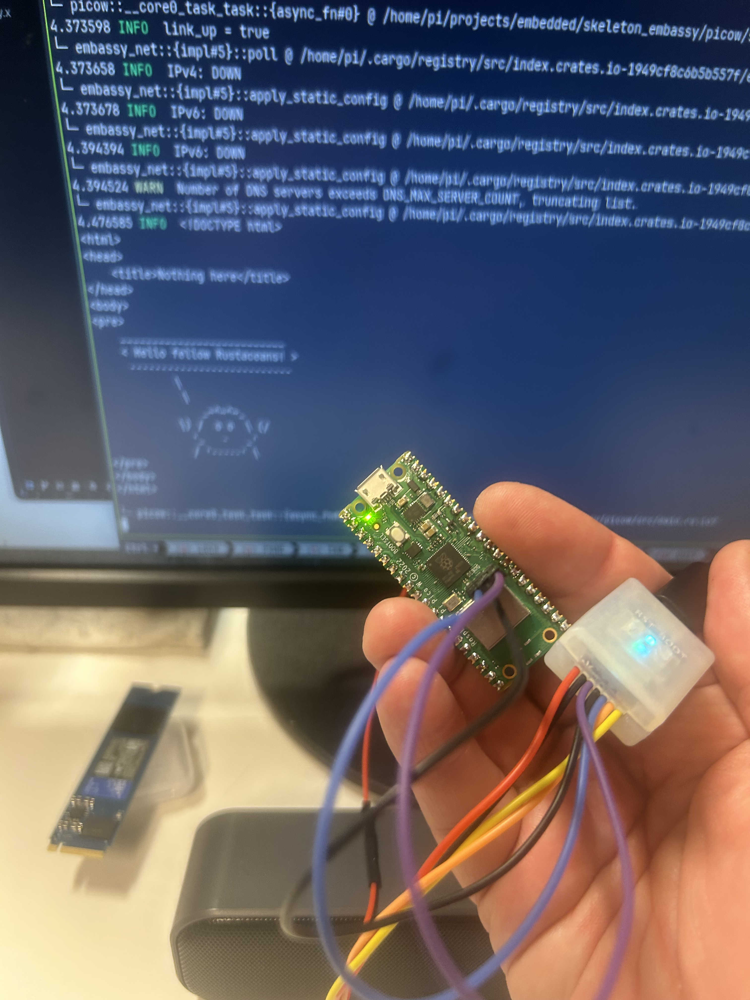
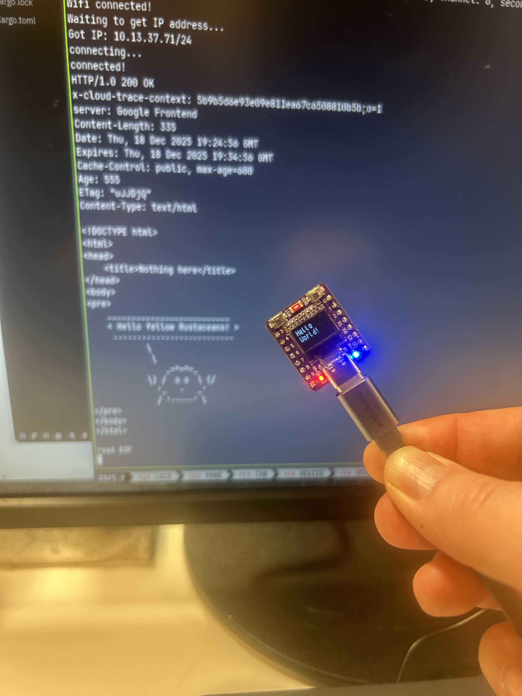

# Workshop in Embedded Rust with Embassy
_Hosted by Dag Bjørndal in Oslo on December 9th 2025_

The accompanying firmware code from this workshop illustrates use of the [Embassy](https://embassy.dev/book/index.html) framework. It is intended as skeleton demonstration of cooperative multitasking. The following devices are featured:
* Raspberry Pi Pico W (ARM)
* Esp32c3 OLED (Risc-V)

|  |  |

## Firmware Features
Both devices do the following:
* The device is initialized in **Embassy** and tasks are started
* The device connects to Wi-Fi using SSID and PSK read from src directory
* The onboard LED is blinked every second
* A small "web page" is retrieved from the the Internet every 10 seconds, and its content is logged
* Logging information is continously sent to the host computer

## Key Differences
The Esp32 device has at small OLED screen which is activated and written to. Dynamic memory allocation using heap is demonstrated on this device. The Esp32 device is connected directly to the host computer via USB. The Pico W device demonstrates using stack memory allocation only. This approach might be considered best practice. The Pico W is connected to the host computer via a programming probe (Picoprobe, ST-Link or Segger). The device uses _Defmt_ to minimize bandwidth demand when logging to the host computer.

## Prerequesites to run on Esp32 OLED
* Install Rust. Follow the instructions on [The Rust Programming Language](https://doc.rust-lang.org/book/ch01-01-installation.html).
* Install espflash with
>cargo install espflash --locked
